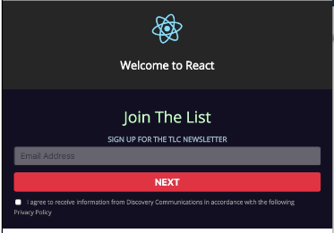

# react-newsletter-component

It's a three step process to sign up for a newsletter:
  - collect email, checked terms, then click 'Sign up',
  - next, collect first name , last name, and click 'Register',
  - show confirmation of sign up

A few extras:
 - used atomic design,
 - added storybook for all components used,
 - responsive

 ### Here's how to run

 `npm run start` or `yarn start` runs the project on http://localhost:3000

 ### Storybook?

 `npm run storybook` runs storybook on http://localhost:9001/
